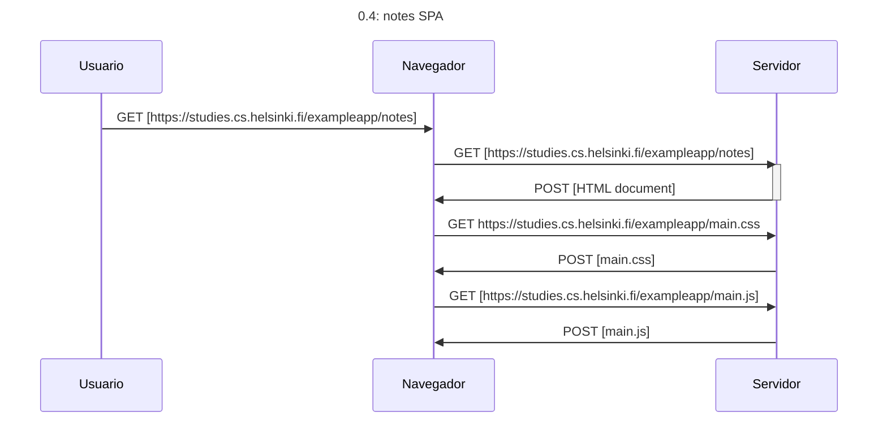

# 0.4: new note

```mermaid
sequenceDiagram
    Title: 0.4: notes SPA

    participant Usuario
    participant Navegador
    participant Servidor
    


    Usuario->>Navegador: GET [https://studies.cs.helsinki.fi/exampleapp/notes]
    Navegador->>Servidor: GET [https://studies.cs.helsinki.fi/exampleapp/notes]
    activate Servidor
    Servidor->>Navegador: POST [HTML document]
    deactivate Servidor

    Navegador->>Servidor: GET https://studies.cs.helsinki.fi/exampleapp/main.css
    Servidor->>Navegador: POST [main.css]

    Navegador->>Servidor: GET [https://studies.cs.helsinki.fi/exampleapp/main.js]
    Servidor->>Navegador: POST [main.js]
    


```

