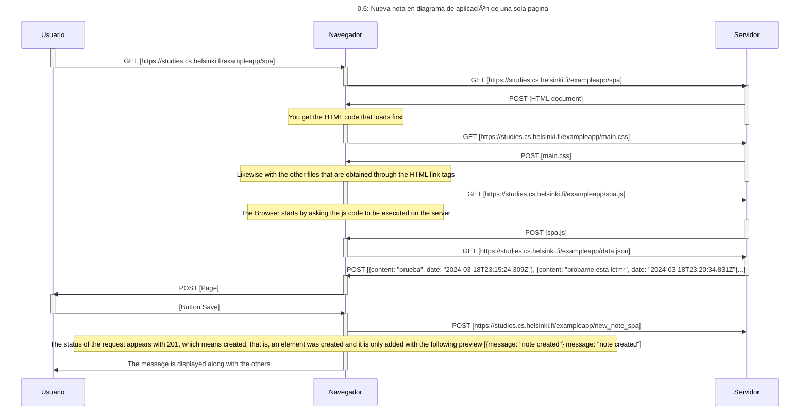

# 0.6: Part 1

```mermaid
sequenceDiagram
    Title: 0.6: Nueva nota en diagrama de aplicación de una sola pagina

    participant Usuario
    participant Navegador
    participant Servidor
    

    activate Usuario
    Usuario->>Navegador: GET [https://studies.cs.helsinki.fi/exampleapp/spa]
    
    deactivate Usuario
    activate Navegador
    Navegador->>Servidor: GET [https://studies.cs.helsinki.fi/exampleapp/spa]
    
    deactivate Navegador
    activate Servidor
    Servidor->>Navegador: POST [HTML document]
    note over Navegador: You get the HTML code that loads first
    deactivate Servidor

    activate Navegador
    Navegador->>Servidor: GET [https://studies.cs.helsinki.fi/exampleapp/main.css]
    deactivate Navegador
    activate Servidor
    Servidor->>Navegador: POST [main.css]
    note over Navegador: Likewise with the other files that are obtained through the HTML link tags
    deactivate Servidor

    activate Navegador
    Navegador->>Servidor: GET [https://studies.cs.helsinki.fi/exampleapp/spa.js]
    note over Navegador: The Browser starts by asking the js code to be executed on the server
    deactivate Navegador
    activate Servidor
    Servidor->>Navegador: POST [spa.js]
    deactivate Servidor

    activate Navegador
    Navegador->>Servidor: GET [https://studies.cs.helsinki.fi/exampleapp/data.json]
    deactivate Navegador
    activate Servidor
    Servidor->>Navegador: POST [{content: "prueba", date: "2024-03-18T23:15:24.309Z"}, {content: "probame esta lctmr", date: "2024-03-18T23:20:34.831Z"}...]
    deactivate Servidor
    
    activate Navegador
    Navegador->>Usuario: POST [Page]
    deactivate Navegador
    activate Usuario
    Usuario->>Navegador: [Button Save]
    deactivate Usuario

    activate Navegador
    Navegador->>Servidor: POST [https://studies.cs.helsinki.fi/exampleapp/new_note_spa]
  note over Navegador: The status of the request appears with 201, which means created, that is, an element was created and it is only added with the following preview [{message: "note created"} message: "note created"]
    Navegador->>Usuario: The message is displayed along with the others
    deactivate Navegador

    
    


    
    


```
